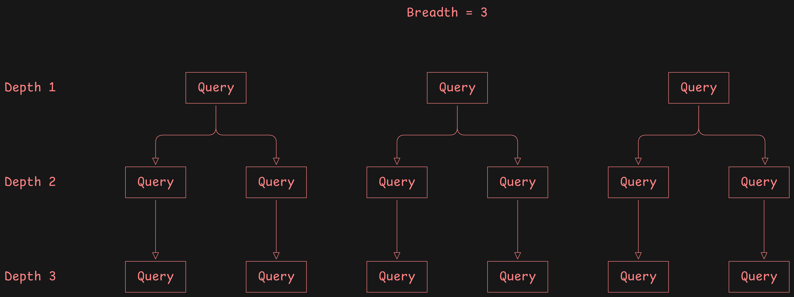

### Detailed working of this whole codebase.
This whole code base is responsible for buildinga highly autonomous deep research agents.  the task of this agent is it will analyze the user's query precisely. The user will give the initial detailed prompt about the topic it want to research on, his current knowledge and what does he want to achive, or learn from this deep research agentic run. This information will be analyzed by master agent such that will generate some list of follow up questionsand user need to answer. User will answer this follow up Questions. After the follow-up questions are answered by the user then uh this agent(master agent) analyzes the users initial query as well as follow-up questions query And generate some initial set of serp query with certain specific set of objectives to precisely get the information that user is asking by scraping the websites. Under each serp query generated by the agent, the codebase will get list of websites where is high probability of finding the information the user is asking. So we will get the list of websites. Then the codebase will try to scrape all the list of websites. And on the successfully scraped list of websites, we will deploy a website analyzing agent. This agent will get the objective task from the master agent that generated the serp query. So now the website analyzer agent for each website will get the objective and the content scraped from the internet.

Website analyzing agent will:
- analyze the content from the website taking the objective into consideration.
- If the Information on the website precisely satisfies the objective and the query that user has askedthe objective and the query that user has asked, Then the precise content  that literally answers the user question will be extracted by the agent and the supporting quote or facts and figures that precisely supplement the objective of the query given by the master agent will be extracted in json format in a variable that tracks the list of all the website analyzing agent, their extracted content(json) and the website they scraped in.
- This precise and highly deterministic objective given to the website analyzer by the master agent will be same for all the websites we got under a specific serp qurey.
- If the websites was unsuccessful to scrape, we just leave it.
- This serp query to get the list of websites. Scrape that website. If successful every successfully scraped websites will have its own website scraping agent. "And this agent will actually extract the valuable infromation from the website.". Keep this in mind this is the actual agent that does the valuable information extraction part. So this process will happen in parallel for all initial set of serp query the master agent has generated. The extracted value will be kept and tracked in a variable for later detailed highly technical report by research writing agent.

### Deep Research
So all the initial set of queries will complete. And then the code will see the breadth and width input. If the breadth is more than one then another set of serp query but taking learnings from previous whole serp query will be initiated. Then the same process of serp query, get list of websites, scrape website, successful website will trigger website analyzing agent. Agent will scrape the actual valuable data according to the objective give by master agent.

### Depth vs Breadth impact in research process.
User initially also gives "breadth" and "depth" in the research process that user wants this agent and the whole codebase to go. This controls how many independent queries you start with and how many rounds of recursive research you do.

Breadth:
When you set a higher breadth (e.g. 2 vs. 1), the master agent generates more SERP queries.

Breadth 1: Only one query is generated, so you get one list of websites.
Breadth 2: Two queries are generated, meaning you explore two different “angles” of your question. This gives you more varied starting websites and can increase the chance of finding additional relevant information.
Depth:
Depth controls how many rounds of follow-up research you do.

Depth 1: The process stops after the initial SERP query, scraping, and analysis.
Depth 2: After gathering and analyzing initial results, the system uses the learnings (the extracted content and insights) to generate a new set of queries and redo the scraping and analysis. This recursion builds on the previous findings, digging deeper into the topic.

So the recursive flow is The master agent analyzes the user’s question and generates an initial SERP query (or multiple, if breadth > 1).
For each query, the system scrapes websites and extracts valuable, objective-specific content.
If depth equals 1, the process ends here.
If depth is greater than 1 (e.g. 2), the system adds a recursive stage where it uses the current findings to generate new queries and further research, expanding and deepening the investigation. This is how the deep research is happening in this codebase.

### Token count and report writing and extracting the valuable information.
One main problem here in the codebase is, if you do alot of serp query and scrape alot of data on from the internet your question also requires that, it is not surprising you very very quickly pass the context limit of one of the highest llm in the world i.e. 2M tokens. And not only that, the model's effective performance significantly decrease after 50k tokens.
To solve that problem, what we do is we constantly track the token count after we scrape each website. If the token count is reaching or just exceeds 50k token, we spin up a new Information Crunching Agent.

### Information Crunching Agent
The task of this agent is code will spin this agent up after every 50k token give or take we scrapped from the websites we got from serp query generated by the master agent.
- Code will count the token we reach every time we scrape a website under a specific serp query and objective. And this token tracking will be different for different serp query.
- Websites under same serp query will get scrapped and each successfull website scrapped, we track the token we scrapped. If the overall scrapped content is reaching 50k tokens, regardless of number of websites scrapped under specific serp query, we spin up a Information Crunching Agent and this agnet will take the detailed objective given by master agent for that specific serp query. See what we are doing here is, we are doing here is we are scraping more and more websites and we are crunching more and more the most valueable information we can get from the internet by scraping the websites with specific agenda given by the master agent. So we crunch as much valuable, value pack and highly factual and figures, highly related technical detail within few tokens as possible with most concise value packed information from too many websites so that we can reach near to the aboslute solution to the problem or answer to the question the user is asking.
- See a website will not be very efficient with words and information we are here being too much efficient with tokens as well as are obvessed with the most related, and highly to the point, 100% to the question that we scrape from the internet. We share it to the master agent in th next iteration of serp query generation whether it is through depth or breadth. And so as we scrape more and more related websites and only extract the abosolute needed and best information as possible, we then pass it to the report writing agent.

### Report writing agent
The task of this report writing agent is to collect all the facts and incremental learnings we have not the random bluff we get from every website but only the cream information we get from website analyzer agent and this Information Crunching Agent. And then write the report such that the report will in very very highly long with every word being pure value to the user technically detailed research paper or report to the user such that the answer of user is 100% answered. Here the report writing agnet must not use his memory but use the soure and data it got to write report. In every section of the report, every sentence that you make must be cited from the highly credible website and source, with precise word or sentence or facts or figures extracted from there. And also at the last of the report we have all the list of websites that were considered to write the report and by neglecting all the bluff source and websites.
- If the depth and breath is small and we are under the absolute token limit of a report writing agentt that is 200k words then that is not a problem, Information Crunching Agent will go and crunch the information and get the most cream infomration from these list of website nalyzing agents that themselves extract only cream result from highly relevent websites. And there information are then collected by the Information Crunching Agent and then even crunches them for report writing. Crunching here mean shear amount of value we compress within certain length of sentence or paragraph without missing any important and highyl relevent related information shared and extractd by webstie analyzer agents. So, website analyzer agents will extract alot of valuable infromation from websites under specific agenda. And  Information Crunching Agent even cruches that but also tracks the information for citations, liek wehre that information was extracted from and which website and what particular quote, facts figures and all.
- If the research is soo deep and breadth that the context window of report writing agent is alos exceedin that is 200k words after even counting all words and tokens of all the information of Information Crunching Agent, we will not at this state then stop the research and write the very detailed technical report.


### Error handling 
By any chance the code get's the critical error in the middle of the research like code not working at all or the report generation is not working at all and all these things, but remember if any website is not successfully scraped that should be considered critical error. So at that time, if you get any critical error, a file named error-output.md file must have all the infomration we have extractd and all the websites we scrapped that were successful and websites that were not successful and alos all the precise crunched infromation from website analyzing agent for individual agent and if Information Crunching Agent was used and called, the precise answer from that everything needs to be strucutrally be in that error-output.md file.

### Check for the whole implementation of above architecture
Everytime you take reference to this file, check and verify if your code changes 100% implements the feature discussed in codebase.md file? and if it is absolutely necessary then only make the changes. But make sure we are 100% implementing the exact flow of the codebase and agent according to codebase.md file.

### Key Consideration
- Make sure every agent(LLM) call we are doing it must have detailed schema file and important filed must be listed as required on that schema. You will get response in string format, you need to parse that string to convert it to json format and then access the desired key from that parsed object.
- Citatios are everything in the whole agentic workflow. Whatever information we extract, we never ever not include citations and source of that information wheteher it is passing from website analyzer agent to Information Crunching Agent or Information Crunching Agent to report writing agent or may be Information Crunching Agent agent to query generating master agent.


### Verify this and make sure that we not removing or breaking this flow.
Okay so everything that you need to do is already mentioned in the architecture if you take a look at both of these files right both of these md filesthen you'll find the implementation just go ahead and implement just go ahead and implement everything and make sure you don't break the existing workflow and that is the most important part heredon't break any existing workflowthink precisely what is neededand why are we doing the way we are doing things because we are using information crunching agent right and the task of it isas we scrape more websites right as the website analyzing agent get more websitessosee we are scraping hundreds of thousands of these websites then obviously the regardless of you if you if you give the raw data to the report writing agent then it doesn't make sense because the context will window will 1000 10 thousand times greater thanthe context window of model will be 10,000 times lesser than the content we script and that doesn't make sense it will not work at all and that's why for individually for every individual successfully scraped website we are deploying we aretriggering a website analyzing agent and this website analyzing is in kitsthe information the most important valuable information with a clear objective right that that precisely satisfies the objective given by they parent master agent right that that generated the serp query. Sowe so this website this website analyzing isn't they they extract the data with the cholera objective given by the master agent right so they get that and and then they accumulate that information for two things for furtherdeep research whether you are doing research more depth or more breadth so this information extracted fromwebsite analyzing is into will beused for further depth research one and another is it will be kept thereandyeah and and and and and this information will be used to write report right at the end of the day we we we we try we we collect the information that we get from individual website and write the report based on that right with the killer object that the user has givenso this is the thingbut the problem we arised is whenthe context window of a model that we are using the report writing is and the context window is it's not infinite right obviously it will be 200 3000 to 200K 300K words right and that's why we are using see we we are scraping thousands of these websites and web website if if we collect all the data of website analyzing agentright thenif it's somehow increased is greater thanthe 200K 300K word then the report will simply not be published right the report will simply not be publishedand so I'm not just talking about 200K 300K words i'm talking about literally one hundred thousand K words script from the Internet and how do you do that because the model end modelscontext window is just 200K 300K words right and so the way you do that is you you take another agent right you take anotherinformation crunching agent and what it does it crunches the information downit say every 50K words that we scrape write every 50K words that we get fromwebsite analyzing isn't what we do if we if theft isyeahfirst what we do is first what we do is we we checkif if we are able to reach the end of the research with just collecting all the words from website analyzing agentreaching to less than 300K words then we don't have to invoke any crunching agent OK but if say the research is going on on and on on and on and and we have already passed theywe have already passed they300K word thresholdif we pass the 300K word threshold then what we do then wethen we invoke website crunching agent and what this website crunching agent does is it crunches the information down with the objective that the parent model has given right it knows and the information crunch will happen under specific serp query. Uh every serp query We'll have its own Information crunching isn't and like let's sayyou have 10 serp querywhat you do is if the total data if we are real in real time we are tracking the number of words that we have accumulated fromthat we have accumulated from all the website scraping agent right and if the threshold is greater than three hundred K words then what we do we trigger Information crunching agent and what this information crunching isn't does is Yeah this information crunching isn'twill under like that first first if I have to make it a bit easy then if the threshold of words is already passed then we will invoke information crunching agent for the number of serp query that we did or we are doing so every sort query that we are doing or we didwe invoke information crunching agent and this information crunching isn'tyeah the information crunching isn't crunches the informationright and within its context it will takeit will take50K words within its context one single information crunching agent call will take50,000 words and then this will be split based on this order like every 50,000 words we will invoke anotherinformation crunching isn'tand the information crons that will happen will be based on the information will be based on the objective given by master agent under a specific serp querysothis will be accumulatedobviously the website that we scrape all the facts and figures this will not be removedunrelevant content will be filtered but the highly relevant content will obviously pass through the website analyzing agent as well as serve queeras well asinformation crunching agentsoand thenthis information branching will happen under every serve query that we do such thatour end report will haveour end bills so that the model they agent that writes the entry board will get 300K word okor underand up until that we will just crunch the information right we will just crunch the information recursively if we are scraping a lot of data and website analyzing agent are also being invoked and the content we are scraping is a lotbut whatever we do our objective will obviously be the objective generated by the master agent sorts that we are preciselywe are precisely giving answer to the user's question ok and if you see from this if you see from meta label then what we are doing here is we are scraping as many resources possible thus we are reaching to the truth of the question that the user is asking we are not we are not extracting a set of information and then just randomly giving some informationand sugar coating they on one dead information to make user satisfied we are not doing that we are ourself moving to the truth to the exact question that the user is asking to the exact source which may not be available on initialwebsite scraping or it may not be available on say just five website that is script right if you do hundreds of if you do ten thousand website scraping then only it might give higher probability that you will reach to the precise answer that the user is looking for and that is what we are doing here so this is what we need to implement in deep-research.ts file.

And also take a look at server .ts fileand that is also responsible for handling the api side.

But remember whenever we are doing an API call you need to make sure that we have a definite schema and for that use Google generative package that we are already implementing there and if you need to take some reference then take a look atright final report forms on that we have inside deep dash research.Ts filethe endand under that you fill wind this 

Generative config and inside that you need to keep the schema and so always give the schema ok and to define the schema as wellyou need to make sure the schema is type safe and yeah use the way we are currently defining this schema and make sure whenever you are doing LLM call make sure there is a definite schemaright and and and the response that you get from LLM needs to be parsed ok because you will get the Json but it will be stringified and you need to parse that to convert it into Json format so that is what you need to doand other thing isso the final report writing is that we are having in this code base don't change the format of that ok because that is already specified in the front end so don't change that whatever you need to change make sure that you absolutely need to make changes and then only change ok yeahand if if possible don't try to change the schema of llm call that we are doing currently yeahdon't try to change that but if you absolutely need to make sure you change that but but whatever you do like how many agent do you invoke make sure the what you need to verify is the information that you are extracting whether it is extracting by information crunching agent or website analyzing agent or the report rising it needs to precisely know that the information that I am processing the information that I am working with this is extracting extracted from this specific website so this information needs to be preservedwhatever whenever you are ok make sure you're doing thatyou need to preserve the source of the information from which website we are getting that because if we remove that then it doesn't make sense right from where did you to that information whether you hallucinated or it's information that you took from a source like no one can tell and this will decrease the credibility of your this will decrease the credibility of this agent so let's make sure that as well and so for that if you need to change some schema right where with the schema you getthe precise website and the content the exact content that was taken from that website right if if you are able to make sure this passes through every layer of llm call we are doing then that is awesome so let's do that ok let's implement this feature 100 percent I have given a full permission to do that,


### High Level Flow
```
    A[Initial Query] --> B[Generate 5 SERP Queries Level 1]
    B --> C[Process Each Query]
    C --> D[Recursive Depth with Math.ceil(breadth/2)]
    D --> E[Level 2: 3 Queries]
    E --> F[Level 3: 2 Queries]
    F --> G[Level 4: 1 Query]
    G --> H[Level 5: 1 Query]
```

### Detailed Query Flow
- Depth Level 1 (Initial)

    - Breadth = 5
    - Generates 5 SERP queries
    - For each query:
        - Get search results (up to 7 URLs per query)
        - Scrape websites
        - Analyze content
        - Token tracking & information crunching if needed

- Depth Level 2

    - Breadth = Math.ceil(5/2) = 3
    - Generates 3 new queries based on findings
    - Process same as level 1
    - Total queries so far: 5 + (5×3) = 20

- Depth Level 3

    - Breadth = Math.ceil(3/2) = 2
    - Generates 2 queries per previous query
    - Total queries so far: 20 + (15×2) = 50

- Depth Level 4

    - Breadth = Math.ceil(2/2) = 1
    - Generates 1 query per previous query
    - Total queries so far: 50 + (30×1) = 80

- Depth Level 5

    - Breadth = 1
    - Final deep dive with 1 query per previous query
    - Total queries so far: 80 + 30 = 110

### Per Query Process
for each query:
  1. Generate SERP results (gets max 7 top URLs)
  2. Scrape websites
  3. For each successful scrape:
     - Analyze content against objective
     - Track tokens
     - If tokens > 50k:
       - Trigger information crunching
     - Store results
  4. After all websites processed:
     - Final information crunching if needed
  5. Start recursive depth if depth > 1

### Image representation of the whole process.
  